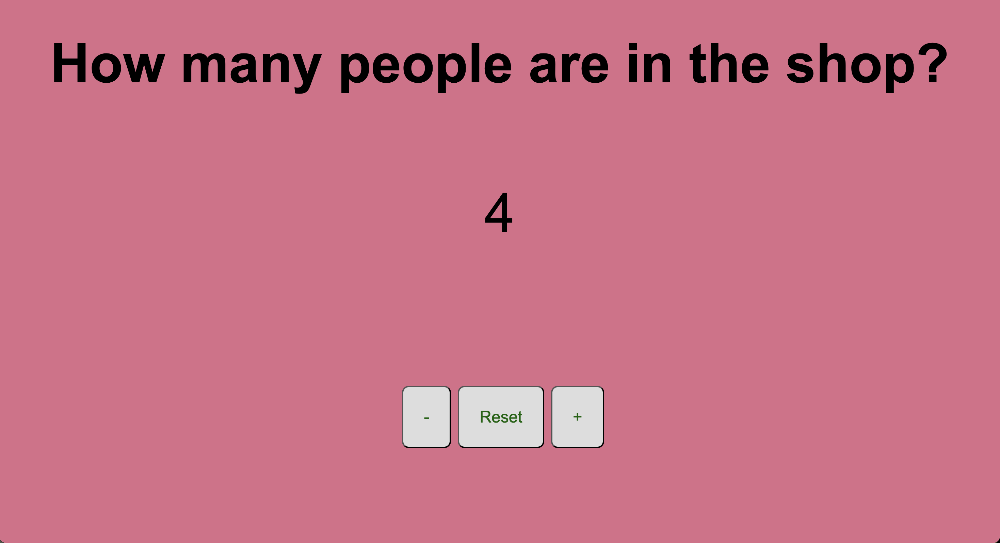

## Shop People Counter

This is a simple project that displays the number of people in the shop and allows you to modify it using buttons.

## 📟 Features

- Displays the number of people in the shop.
- You can increase or decrease the number of people using the "+" and "-" buttons.
- You can reset the number of people to zero using the "Reset" button.
- Every time the number of people is changed, the background and text color change randomly for a fun visual effect.

## 📲 Technologies Used

- HTML
- CSS
- JavaScript

## 🔧 How to Use

1. Clone this repository to your computer.
2. Open the `index.html` file in your web browser.
3. Use the "+" and "-" buttons to modify the number of people in the shop.
4. Click the "Reset" button to reset the number of people to zero.

## 📄 License

This project is released under the [MIT License](LICENSE).
